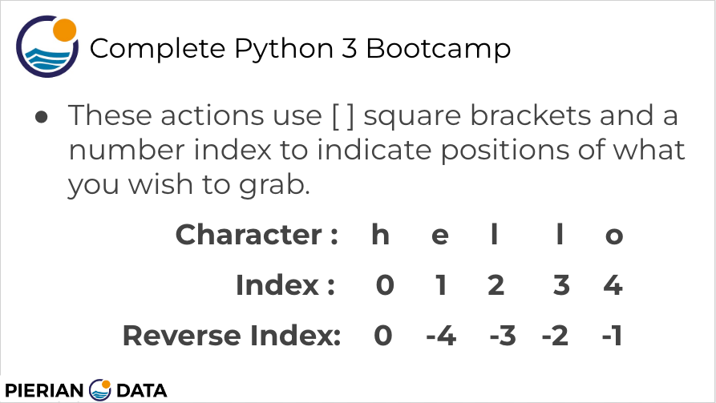
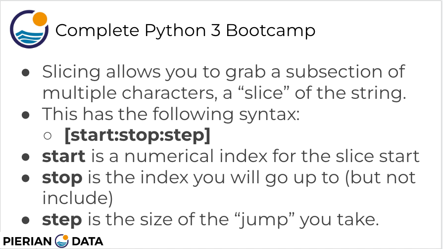

#  15. Introduction to Strings

---

---

-   [00-Python Object and Data Structure Basics](https://docs.google.com/presentation/d/1lMiOnSVp1dbTOOLMXJXqDyUJz5-k7n-rVPgQtMj7wcA/edit#slide=id.g2586a91ea0_0_101)

Welcome back, everyone.

In this lecture, we're going to be discussing strings.

Strings are sequences of characters using the syntax of either single quotes or double quotes.

Here we can see three examples.

First, we have hello of single quotes, then hello at double quotes.

And then what's nice about having both options of single quotes or double quotes?

It means that if you have a single quote in your string that you want to keep and not have that end

your actual string, you can wrap it in the other type of quote, such as double quotes or vice versa.

So here we can see I don't do that, has a single quote in there, but we don't want that single quote

to suddenly end the string so we can wrap the whole thing in double quotes.

And we'll see an example of that later on in the Jupyter Notebook.

Now it's important to note here is that strings are ordered sequences and that means we can use indexing

or slicing to grab subsections of the string because we know each character has a specific position

to be in an indexing notation.

It uses that square bracket notation after the string or the name of the variable assigned to the string.

And we're going to see lots of examples of indexing and slicing in just a little bit.

So indexing is the term used when you want to grab a single character from the string.

So the way this works is that every single character has an index position assigned to it, so you start

at zero.

That's another important note in Python, that indexing starts at zero.

So H has a corresponding number of zero.

E has the corresponding number of one.

L two.

l304.

So if I wanted to grab the E, what I would use is inside the square brackets, I would pass in a one

after the string and then it would return back.

E And we'll see examples of that later on.

What's also interesting about Python is you can actually use reverse indexing, so maybe you want it

to grab the last letter of a string, but you didn't actually know how long the string was.

All you knew was you wanted to grab the last letter.

Well, luckily, there's reverse indexing available to you, so you can go just grab negative one and

it'll grab the last letter of the string, regardless of how long that string actually is.

Slicing allows you to grab a subsection of multiple characters, otherwise known as a slice of the string.

And this has slightly different syntax.

Again, it's going to be in square brackets, but because we're grabbing a subsection, we're going

to be able to define three parts of this.

We're going to be able to say start, stop and step.

So again, this goes in square brackets with a colon separating each of these three terms.

Start is going to be the numerical index of the slice start.

Stop is going to be the index you will go up to but not include.

So that's an important note there.

And we're going to really focus on that in the examples we'll see in just a bit.

And then step is the size of the jump you take from start to stop.

So let's explore all these concepts.

They're going to make a lot more sense when we actually see the code examples.

Let's hop over to a notebook.

Okay, let's quickly show a couple of examples of a string.

Again, we can use single quotes.

Hello?

Or we can use double quotes.

So here I say double quotes of world.

You can also have an entire phrase.

Doesn't need to just be one word so we can say this is also a string.

So we have a whole phrase there and the white spaces count as characters inside of the string.

Now, something we should note here is that we can mix single quotes and double quotes.

So if I'm going to say something like, for instance, I'm.

Going on a run.

So note what's happening here because I'm using single quotes on the outside.

Only part of this is getting highlighted with the syntax.

So this is going to confuse Python because it thinks that you're trying to end the string here when

really I'm trying to end the string here.

So if I try to run the cell, you'll say an error here, invalid syntax.

What I really want to do is wrap this in double quotes.

And that way I won't have an error when I have this single quote in here.

So then when I run, this python has no problem.

It says, okay, I get what you're trying to do here, trying to have a single quote there, stay.

And that's actually not part of the definition of the string.

So now let's discuss actually printing out a string.

So far we're actually just asking the string to be returned and that's the reason we see in and out

with these cells.

And that's also the reason we actually see the quotes in the output below the cell.

But we can use the print function to actually print out a string.

So we're going to say print.

Hello.

And if we run this note, what we actually get back, we no longer see the out in the cell and instead

we no longer see the quotes themselves.

We're actually just printing out the actual string.

And the reason this is important is because let's imagine I wanted to say Hello World one and then I

also want it to say Hello World too.

If I were to run this, what ends up happening is I only get back that last string.

In order to see everything, I actually have to print out the results.

So I will say print.

And wrap this in parentheses.

Print Helloworld one and then I'll say print.

And then say Hello World two.

And then when I run this, I get to see both strings, print it out so I no longer see the output.

I'm actually just printing the results.

Now something else I want to mention is that there's actually escape sequences and escape sequences

applied to kind of have special commands inside of your string.

So let's just go ahead and say print hello world.

And if I run this I see hello world printed on one line but I can actually add an escape sequence so

it's going to be a backslash.

N And what this does is it basically tells Python, hey, this end right here, that's no longer the

character.

N I actually want you to because of this backslash, treat this as a new line.

So if that escape character there, it's going to say Prince, hello space.

Then a new line and then Space World.

So that's what we see here.

Hello, space and world.

If I want a world to be lined up with.

Hello, I could actually just touch it like this.

Run that and then I see hello world and Python knows not to include this letter end there because it's

essentially attached to that backslash.

So another popular escape sequence is T for tab.

And if I run that I get back.

Hello tab.

So four spaces world and we'll be talking a lot more about this when we discuss print formatting coming

up next.

For now, another built in function that I want to show you is the line function or the length function.

So this allows you to check the length of a string so I can say hello.

And if I run this, I get back length of five because there's five characters in that string if there

happens to be a space in the string.

So I will say I am hungry.

Let's make it more obvious.

We'll just say I am.

And we run this here, we can see there's four.

So we have eye space a m So that counts as a length of four characters in the string.

All right.

We'll stop it here for now.

And in the very next lecture, we'll pick up right where we left off discussing string indexing and

string slicing.

I'll see you there.

---
[Previous](./14_Variable-Assignments.md) | [Next](./16_Indexing-and-Slicing-with-Strings.md)