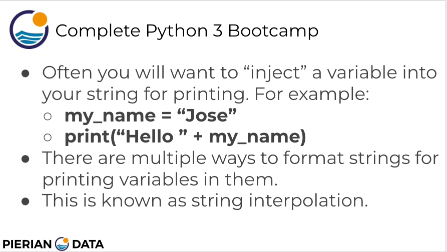
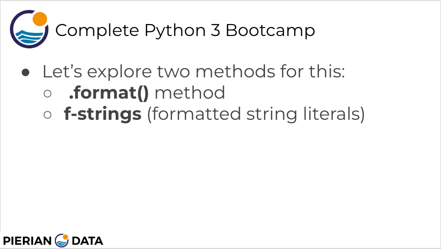

#  19. Print Formatting with Strings

-   [00-Python Object and Data Structure Basics](https://docs.google.com/presentation/d/1lMiOnSVp1dbTOOLMXJXqDyUJz5-k7n-rVPgQtMj7wcA/edit#slide=id.g2586a91ea0_0_101)

---

<details>
  <summary><h3>Print Formatting with Strings</h3></summary>


---

---


-   [String Formatting for Printing](https://colab.research.google.com/drive/1_nnc3aTnTkPpNEWm2LWa_nyvh6OWqiAB#scrollTo=_f_sg_7KB-Nt&line=1&uniqifier=1)

```
print ('This is a string {}'.format("INSERTED"))

# This is a string INSERTED
```

```
print ("The {} {} {}".format('fox', 'brown', 'quick'))

# The fox brown quick
```

```
print ("The {2} {1} {0}".format('fox', 'brown', 'quick'))

# The quick brown fox
```

```
print ("The {0} {0} {0}".format('fox', 'brown', 'quick'))

# The fox fox fox
```

```
print ("The {q} {b} {f}".format(f = 'fox', b = 'brown', q = 'quick'))

# The quick brown fox
```


</details>

---
[Previous](./18_Strings-FAQ.md) | [Next](./20_Print-Formatting-FAQs.md)