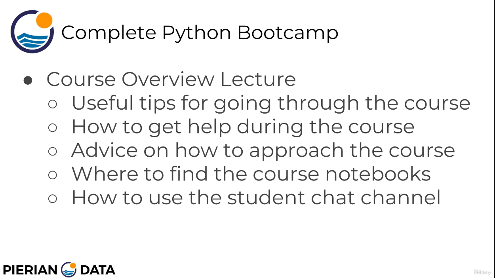
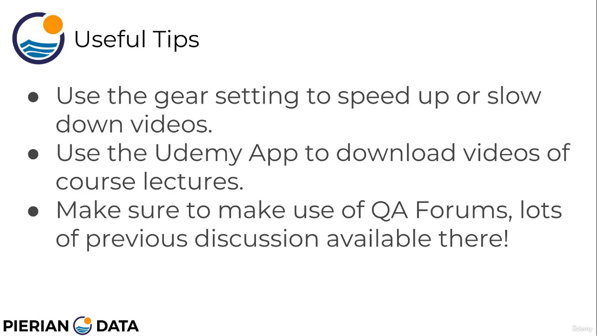
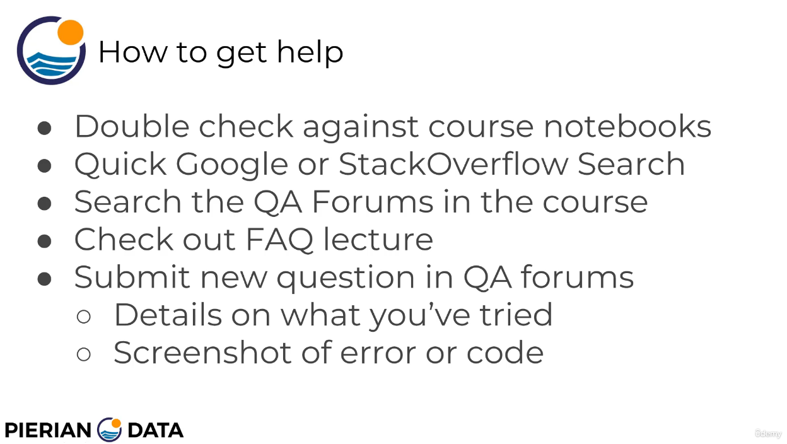
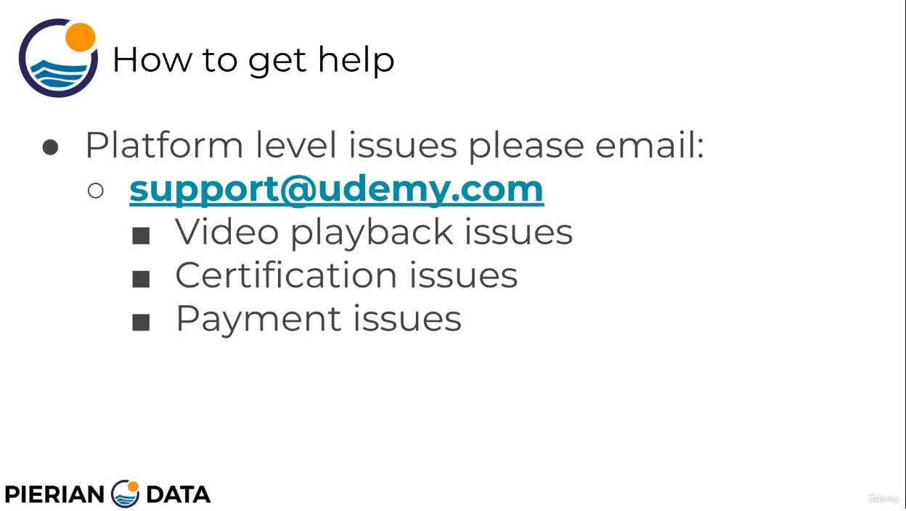

# 2. Course Introduction

---

---

---

---

Hey, everyone, it's Josie here, and welcome to the Course Overview Lecture.

I'm super excited that you're starting your journey to learn Python.

I know it's sometimes tempting to just skip these intro lectures and go straight to the technical material, but I have one favor to ask of you as you go through this course, and that is to please don't skip this lecture.

We're going to cover a lot of important material in this lecture, such as where to find the notebooks, how to approach the course, how to ask questions.

So please watch this entire lecture.

That way you can get the best course taking experience possible.

All right, let's not waste any more of your time, and let's get started.

In this lecture, we're going to talk about useful tips for going through the course, how to get help during the course, general advice on how to approach the course, where to find the course notebooks

and how to use the student chat channel.

So some general tips as far as your course taking experience.

When you're using the video player, you can use the gear setting to either speed up or slow down videos.

So if you're like me and you like watching videos a little faster, maybe on two X speed, you can use the gear setting for that.

Or maybe English isn't your first language.

You can slow down the videos and you can also do things like turn on closed captions, or you can also change the streaming quality.

You can use the YouTube app to download videos of the course lectures.

And for more information on the YouTube app, you can check out the YouTube support pages for it. Also, make sure to use the Q&A forums.

There's lots of previous discussion available there to help answer any questions you may have.

Let's talk about getting help in a little more detail.

Let's talk about the best series of steps to take when you have a question that arises while you're taking the course.

If you're coding along with the videos, it's sometimes really easy to make a typo, which is why we provide course notebooks of explanatory text and the python code for every single lecture.

So if you ever get an error due to code that you thought you were following along with in the video,

you should double check your code against our course notebooks.

You can always just download the notebooks directly and run the notebooks or copy and paste from the notebooks themselves.

That way you can make sure that your error isn't due to some typo while you're watching the video.

Now, not every single question is going to be directly related to following along with our code.

And if you do have a question, sometimes a quick Google search or a Stack Overflow search will get you the answer faster than anyone else could.

So I would always recommend doing a Google search or StackOverflow search, especially if you actually end up getting an error code in Python with maybe some of your own code that you were trying out.

Just copy and paste the error code into Google and a lot of times the very first hit is going to answer your question.

Now, let's say that still doesn't help you.

What you should do is search our Q&A forums.

In the course we've had, over a quarter of a million students go through this course.

So you can almost imagine that any question possible has already been asked and answered by either myself or our teaching assistants.

So you should definitely search the Q&A forums before posting their.

Now let's see.

I have a question on just general course, things like how to get a certification or where the Udemy app is, those kind of things are answered in our FAQ lecture.

So we have an article lecture where frequently asked questions that you can check out for useful links and more information.

Let's say you did all those steps and you're still confused on something.

That's absolutely no problem.

We're here to help you.

The way to do that is to submit a new question to the Q A forums and make sure you provide details on what you've tried, screenshots of your error code and really as much detail as possible.

That way we can help you as quickly as possible.

Now let's say you have some sort of platform level issue for those kind of things.

You should email support at YouTube.com or go to the Udemy support page and open a new issue there.

So platform level issues are things like having video playback issues, questions or issues with your certification or questions or issues with payments.

Those are platform level issues and we can't really help you out.

So email support at YouTube.com to quickly get help on that.

Finally, let's talk about how to approach the course.

The best way to approach the course is to really review the notebooks along with the video.

The videos are really great, but we want you to leverage the power of the notebooks we have for you.

And both beginners and experienced users can really use the notebooks to best suit them for beginners.

I would recommend that you read the extra notes in the notebook as you go along with the video guide.

If you're more experienced, what you may want to use notebooks for is to quickly review them and see which parts you may already know or may already quickly feel comfortable with.

That way, you don't feel slowed down by the videos.

So beginners really use the notebooks, read them well, go along with the video experience users.

Check out the notebooks first and see if you really need the video or it allows you to maybe skip certain parts of the video and go to where you need a little more drilling down in.

As far as his course notebooks that we keep mentioning, you should check your automated welcome message for the link to the notebooks.

Later on, we're going to review how to actually download and open them in the Running Python Code lecture.

These notebooks are actually a special file type, meaning when you download them, you're not able to just double click them and have them open.

We discuss in a lot more detail throughout the course on how to actually open these notebooks that you've downloaded.

The notebooks are hosted on GitHub, though, so you'll be able to view them at any time, even without downloading them.

The link to download them is also in our FAQ lecture.

So either check your welcome message or go to the FAQ lecture for that link.

Now let's talk about the student chat channel.

There's also a link for our student chat channel in the automated welcome message to join our Discord Server.

This is a chat channel that's shared between all our courses, so you'll be able to interact with students learning about data science, finance, SQL, R Scala and more in the automated welcome message.

There's also a link to a YouTube video describing further information on how to use and log in to our chat server.

It's actually super easy, but we have that YouTube video in case there's any confusion.

Something to keep in mind is that the purpose of that chat channel is to connect students with other students.

Technical questions related to the course material are still best suited for a question and answer forums, so you should use that chat channel to have fun, engage with other students.

But if you're having problems with a lecture or a topic or concept in the actual course, those questions are best suited for the question answer forums or remember, you can always search the question and answer forums for previously posted questions.

All right.

Last but not least, a huge thank you for enrolling in this course.

I'm humbled by all the students that enrolled, and I'm privileged to be your instructor for Python

OC.

Let's get started and take you from zero to hero.

##  Resources for this lecture

---

-   [000-Course-Overview-and Installs](https://docs.google.com/presentation/d/1KBNgNB_JnuXtqpz7Tk7PBinCDteB7pmpeRwZQYqODo0/edit#slide=id.p)

---
[Previous](./1_Auto-Welcome-Message.md) | [Next](./3_Course-Curriculum-Overview.md)